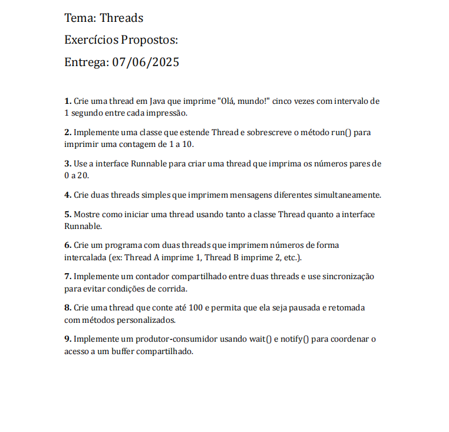
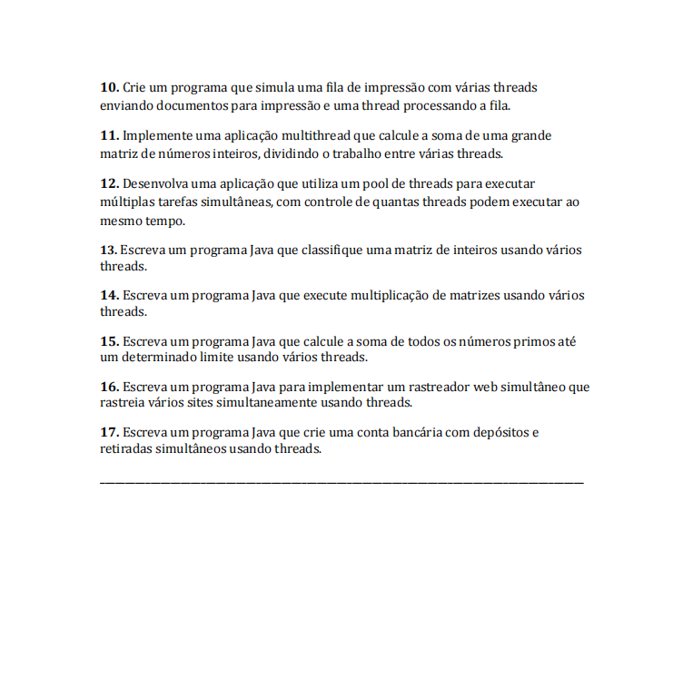

# Threads em Java ☕

Repositório contendo exercícios de **threads e concorrência em Java**, abordando a criação de threads com `Thread` e `Runnable`, sincronização (`synchronized`, `wait`, `notify`), pools de threads (`ExecutorService`, `ForkJoinPool`), concorrência em matrizes e algoritmos paralelos.

Os exercícios foram desenvolvidos durante o **4º período do curso de Engenharia de Software na Faculdade de Nova Serrana (FANS)**, na disciplina de **Programação Orientada a Objetos II**.

---

## Atividades Propostas:

---

## Relação de Exercícios

| N° | Exercício | Arquivo | Descrição |
|:---|:---|:---|:---|
| 01 | Thread Olá Mundo | [`ola_mundo.java`](ola_mundo.java) | Imprime "Olá, mundo!" 5 vezes com intervalo de 1s |
| 02 | Contagem com Classe Thread | [`contagem_thread.java`](contagem_thread.java) | Estende `Thread` e imprime contagem de 1 a 10 |
| 03 | Números Pares com Runnable | [`numeros_pares.java`](numeros_pares.java) | Implementa `Runnable` e imprime números pares de 0 a 20 |
| 04 | Mensagens Simultâneas | [`mensagens_simultaneas.java`](mensagens_simultaneas.java) | Duas threads imprimindo mensagens concorrentes |
| 05 | Thread vs Runnable | [`thread_e_runnable.java`](thread_e_runnable.java) | Demonstração de inicialização via `Thread` e `Runnable` |
| 06 | Impressão Intercalada | [`impressao_intercalada.java`](impressao_intercalada.java) | Duas threads imprimindo de forma alternada |
| 07 | Contador Compartilhado | [`contador_compartilhado.java`](contador_compartilhado.java) | Prevenção de race condition com `synchronized` |
| 08 | Pausar e Retomar Thread | [`pausar_retomar_thread.java`](pausar_retomar_thread.java) | Controle de execução com métodos customizados |
| 09 | Produtor e Consumidor | [`produtor_consumidor.java`](produtor_consumidor.java) | Buffer compartilhado usando `wait()` e `notify()` |
| 10 | Fila de Impressão | [`fila_impressao.java`](fila_impressao.java) | Fila de documentos concorrente com thread consumidora |
| 11 | Soma de Matriz Multithread | [`soma_matriz_multithread.java`](soma_matriz_multithread.java) | Soma dos elementos de matriz dividida por threads |
| 12 | Pool de Threads | [`pool_de_threads.java`](pool_de_threads.java) | Gerenciamento de tarefas simultâneas com `ExecutorService` |
| 13 | Ordenação de Matriz | [`ordenacao_matriz_multithread.java`](ordenacao_matriz_multithread.java) | MergeSort paralelo utilizando `ForkJoinPool` |
| 14 | Multiplicação de Matrizes | [`multiplicacao_matrizes.java`](multiplicacao_matrizes.java) | Multiplicação paralela de matrizes com threads |
| 15 | Soma de Primos Multithread | [`soma_primos_multithread.java`](soma_primos_multithread.java) | Cálculo de números primos em intervalos paralelos |
| 16 | Web Crawler Simultâneo | [`web_crawler_multithread.java`](web_crawler_multithread.java) | Simulador de rastreamento de URLs em paralelo |
| 17 | Conta Bancária Concorrente | [`conta_bancaria_simultanea.java`](conta_bancaria_simultanea.java) | Saques e depósitos sincronizados em conta compartilhada |

---

## Tecnologias Utilizadas

- **Java** (JDK 17+)
- **Multithreading & Concorrência** (`java.lang.Thread`, `java.lang.Runnable`, `ExecutorService`, `ForkJoinPool`)
- **Sincronização & Comunicação** (`synchronized`, `wait()`, `notify()`)

---

## Objetivo

Praticar o desenvolvimento com **threads e concorrência** em Java, utilizando `Thread`, `Runnable`, mecanismos de sincronização (`synchronized`, `wait`, `notify`) e pools de execução (`ExecutorService`, `ForkJoinPool`).

---

## Autor

**Matheus Pereira**   
- Estudante de Engenharia de Software Faculdade de Nova Serrana  
- Apaixonado por desenvolvimento desktop  
- GitHub: https://github.com/MatheusPereiira
